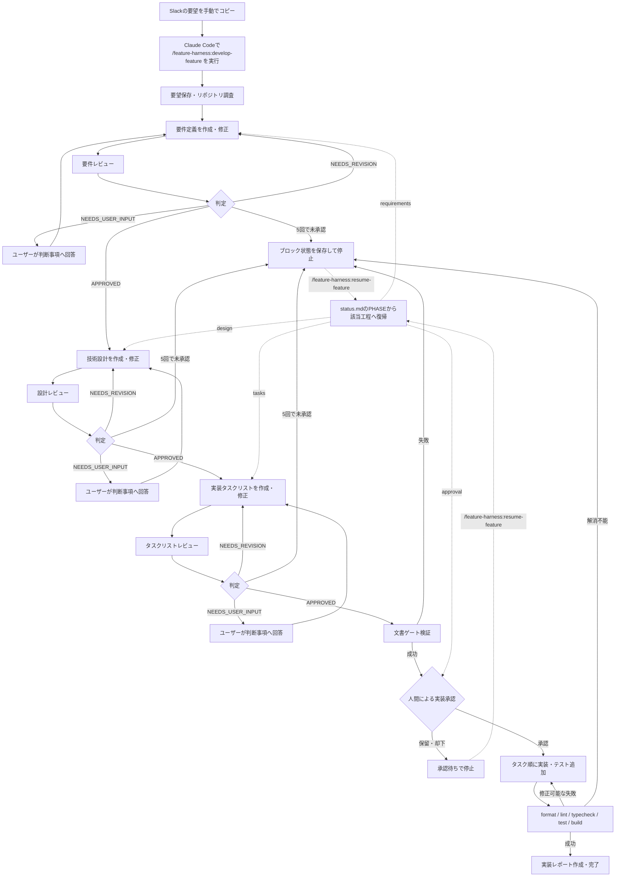

# Claude Code Feature Harness

Slackの要望を人間がClaude Codeへ貼り付けた後、以下をClaude Code内で
進めるローカルプラグインです。

1. 要件定義
2. 独立サブエージェントによるレビューと修正反復
3. 技術設計
4. 独立サブエージェントによるレビューと修正反復
5. 実装タスクリスト
6. 独立サブエージェントによるレビューと修正反復
7. 人間による実装承認
8. 実装と検証

Slack APIとの連携は行いません。

## フロー



各文書の作成者とレビュアーは別サブエージェントです。途中で停止した場合も、
成果物と `status.md` をもとに再開できます。

## 特徴

- 作成者とレビュアーを別サブエージェントに分離
- 各文書を最大5回レビュー
- 指摘、ユーザー確認、承認を固定形式で判定
- 全文書の承認前には実装しない
- 実装前に人間の明示承認を要求
- セッションが中断しても成果物と `status.md` から再開可能
- 既存の未コミット変更を保持

## 必要なもの

- Claude Code 2.1.143以降
- `bash`

## 起動

対象リポジトリのルートで実行します。

```bash
claude --plugin-dir /absolute/path/to/claude-code-feature-harness
```

起動後、Slackからコピーした要望を引数にして実行します。

```text
/feature-harness:develop-feature 管理画面のメンバー一覧を無限スクロールにしたい。
検索条件を変えた場合は先頭から取得し直してほしい。
```

長い要望は、コマンド入力後にそのまま複数行で貼り付けられます。引数を
省略した場合はClaudeが入力を求めます。

## 再開

同じリポジトリでプラグインを読み込み、feature slugまたは成果物パスを
指定します。

```text
/feature-harness:resume-feature member-infinite-scroll
```

```text
/feature-harness:resume-feature docs/features/member-infinite-scroll
```

## 成果物

対象リポジトリに次のファイルを生成します。

```text
docs/features/<feature-slug>/
├── request.md
├── decisions.md
├── requirements.md
├── design.md
├── tasks.md
├── status.md
├── implementation-report.md
└── history/
    ├── requirements-v1.md
    ├── requirements-review-v1.md
    ├── design-v1.md
    ├── design-review-v1.md
    ├── tasks-v1.md
    └── tasks-review-v1.md
```

レビューや修正を繰り返した場合、`v2`、`v3` と履歴が追加されます。

## サブエージェント

| エージェント | 権限 | 役割 |
|-------------|------|------|
| `requirements-analyst` | 読み取り専用 | 要件定義の作成と修正 |
| `requirements-reviewer` | 読み取り専用 | 要件の独立レビュー |
| `system-designer` | 読み取り専用 | 技術設計の作成と修正 |
| `design-reviewer` | 読み取り専用 | 設計の独立レビュー |
| `task-planner` | 読み取り専用 | タスクリストの作成と修正 |
| `task-reviewer` | 読み取り専用 | タスクリストの独立レビュー |
| `implementation-engineer` | 編集・Bashあり | 承認後の実装とテスト |

プラグインとして読み込まれるため、Claude Code上ではエージェント名に
`feature-harness:` 名前空間が付きます。

## 停止条件

次の場合は自動進行せず停止します。

- 重要なビジネス判断にユーザー回答が必要
- 文書レビューが5回で承認されない
- 文書ゲートの検証に失敗
- 実装前の人間承認待ち
- 設計と実リポジトリが矛盾
- テストやビルドを解消できない

## 開発時の検証

```bash
claude plugin validate ./claude-code-feature-harness --strict
bash -n ./claude-code-feature-harness/scripts/check-document-gates.sh
```

ローカル変更を読み直すには、Claude Codeを再起動するか
`/reload-plugins` を実行します。
