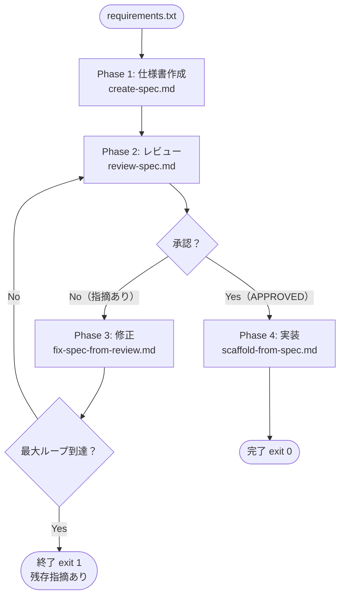

# spec-to-code

要件テキストを入力するだけで、仕様書作成 → レビュー → 修正 → 実装までを Claude Code が全自動で行うパイプライン。

## 動作フロー



レビューで指摘があれば自動修正 → 再レビューをループし、承認されたら実装へ進む。

## 必要なもの

- [Claude Code CLI](https://docs.anthropic.com/claude-code) がインストール済みであること
- `claude` コマンドが PATH に通っていること

## 使い方

```bash
cd ~/develop/instructions/spec-to-code

./pipeline.sh <requirements.txt> [オプション]
```

### オプション

| オプション | デフォルト | 説明 |
|-----------|-----------|------|
| `--name NAME` | `feature` | 生成ファイルのプレフィックス（例: `user-auth`） |
| `--max-loops N` | `3` | レビュー→修正の最大繰り返し回数 |
| `--output-dir DIR` | `./output` | 仕様書・レビュー結果の保存先 |
| `--target-dir DIR` | `.` | 実装コードの出力先リポジトリパス |

### 実行例

```bash
# シンプルな実行
./pipeline.sh requirements.txt

# プロジェクトを指定して実行
./pipeline.sh requirements.txt \
  --name user-auth \
  --output-dir ./docs \
  --target-dir ~/projects/my-app
```

### 終了コード

| コード | 意味 |
|--------|------|
| `0` | 正常完了（実装まで完了） |
| `1` | 最大ループ到達（残存指摘あり、実装スキップ） |
| `2` | 入力ファイルなし・ファイルが見つからない |

## ファイル構成

```
spec-to-code/
├── README.md                  # このファイル
├── pipeline.sh                # メイン実行スクリプト
├── create-spec.md             # Phase 1: 要件 → 仕様書
├── review-spec.md             # Phase 2: 仕様書レビュー（VERDICT自動判定）
├── fix-spec-from-review.md    # Phase 3: レビュー指摘 → 仕様書修正
└── scaffold-from-spec.md      # Phase 4: 仕様書 → 実装コード生成
```

## 生成される仕様書のフォーマット

すべての仕様書は以下の固定セクション構成で生成される。

```
# 仕様書: {機能名}

## 背景・目的
## 対象ユーザー
## 機能要件
## 非機能要件
## 画面 / API 設計
## 除外スコープ
## 受け入れ条件
## 前提・解釈
```

## 各指示書の単独利用

パイプライン全体を使わず、各フェーズだけを個別に使うこともできる。

```bash
# 仕様書だけ作りたい
claude "$(cat create-spec.md)" < requirements.txt

# 既存の仕様書をレビューしたい
claude "$(cat review-spec.md)

$(cat my-spec.md)"
```
