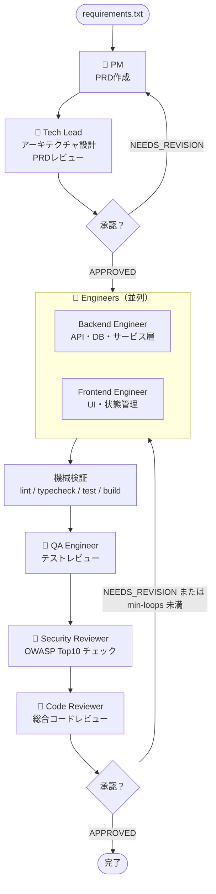

# spec-to-code

要件テキストを入力するだけで、Claude Code が実際のエンジニア組織と同じ役割分担で
仕様策定 → 設計 → 実ファイル編集 → 検証 → QA → セキュリティレビュー → コードレビュー → 修正反復までを自動で行うパイプライン。

このパイプラインは、Claude を長時間動かしてレビュー修正を複数回繰り返すことを前提にしている。
`--min-loops` で最低反復回数を指定し、レビューで承認されても最低回数までは追加観点のレビューを続ける。

## 動作フロー



## ロール一覧

| ロール | ファイル | 役割 |
|--------|---------|------|
| PM | `roles/pm.md` | 要件整理・PRD 作成 |
| Tech Lead | `roles/tech-lead.md` | アーキテクチャ設計・PRD レビュー |
| Backend Engineer | `roles/backend-engineer.md` | API・DB・ビジネスロジック実装 |
| Frontend Engineer | `roles/frontend-engineer.md` | UI・コンポーネント・状態管理実装 |
| QA Engineer | `roles/qa-engineer.md` | テスト追加・受け入れ条件レビュー |
| Security Reviewer | `roles/security-reviewer.md` | セキュリティレビュー（OWASP Top10） |
| Code Reviewer | `roles/code-reviewer.md` | 総合コードレビュー・承認判定 |

## 必要なもの

- [Claude Code CLI](https://docs.anthropic.com/claude-code) がインストール済みであること
- `claude` コマンドが PATH に通っていること

## 使い方

```bash
cd ~/develop/instructions/spec-to-code

./pipeline.sh <requirements.txt> [オプション]
```

### オプション

| オプション | デフォルト | 説明 |
|-----------|-----------|------|
| `--name NAME` | `feature` | 生成ファイルのプレフィックス |
| `--min-loops N` | `2` | 実装・検証・レビュー修正の最低反復回数 |
| `--max-loops N` | `3` | 実装・検証・レビュー修正の最大反復回数 |
| `--output-dir DIR` | `./output` | 成果物の保存先 |
| `--target-dir DIR` | `.` | 実装コードの出力先リポジトリパス |
| `--verify-cmd CMD` | `auto` | 検証コマンド。`auto` の場合はリポジトリから推定 |

### 実行例

```bash
./pipeline.sh requirements.txt \
  --name user-auth \
  --target-dir ~/projects/my-app \
  --output-dir ./docs \
  --min-loops 2 \
  --max-loops 5 \
  --verify-cmd "pnpm lint && pnpm typecheck && pnpm test && pnpm build"
```

## 生成される成果物

```
output/
├── {name}.prd.md                  # PM が作成した PRD
├── {name}.architecture.md         # Tech Lead のアーキテクチャ設計
├── {name}.implementation-plan.md  # 実装計画
├── {name}.verification.{N}.md     # lint / test / build などの検証ログ
├── {name}.qa.{N}.md               # QA レビュー
├── {name}.security.{N}.md         # セキュリティレビュー
├── {name}.review.{N}.md           # コードレビュー
├── {name}.diff.{N}.md             # 差分サマリ
└── {name}.summary.md              # 最終サマリ
```

実装コードは Markdown ではなく、`--target-dir` の実ファイルへ直接反映される。

## 反復の終了条件

以下を満たすまで、最大 `--max-loops` まで自動で修正を繰り返す。

- 実装レビュー反復数が `--min-loops` 以上
- 検証コマンドが成功、または妥当な理由付きでスキップ
- `git diff --check` が成功
- Security の Critical / High 指摘が 0
- Code Review の高 / 中指摘が 0
- QA の重大な未カバー項目が 0

## 終了コード

| コード | 意味 |
|--------|------|
| `0` | 全フェーズ正常完了 |
| `1` | 最大ループ到達（承認されずに終了） |
| `2` | 入力ファイルなし・ファイルが見つからない |

## ファイル構成

```
spec-to-code/
├── README.md
├── pipeline.sh
├── roles/
│   ├── pm.md
│   ├── tech-lead.md
│   ├── backend-engineer.md
│   ├── frontend-engineer.md
│   ├── qa-engineer.md
│   ├── security-reviewer.md
│   └── code-reviewer.md
├── create-spec.md           # 単体利用向け（仕様書作成のみ）
├── review-spec.md           # 単体利用向け（仕様書レビューのみ）
├── fix-spec-from-review.md  # 単体利用向け（仕様書修正のみ）
└── scaffold-from-spec.md    # 単体利用向け（実装コード生成のみ）
```
